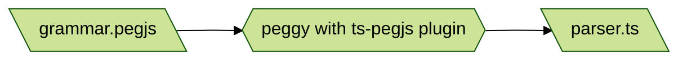

# Hyperscript Transpiled

Experiment to transpile [`_hyperscript`](https://hyperscript.org) into JS.

This repository is running TypeScript, compiling via Vite.JS

This is a continuation of the experiment which started in [this repository](https://github.com/reedspool/hyperscript-transpiled-experiment).

## HTML

The HTML page demos what is currently working.

To see the HTML page in action, you'll need to serve it. An easy way to do this is

```sh
npm run dev # Vite dev server
```

## Generate Parser

To generate the parser file from the grammar file, run `npm run generate_parser`. 

This uses [PeggyJS](https://peggyjs.org/documentation.html) to take the [PEG](https://en.wikipedia.org/wiki/Parsing_expression_grammar) language grammar file and output a parser in a new file. The parser is actually a TypeScript file, thanks to the [ts-pegjs](https://github.com/metadevpro/ts-pegjs) plugin. Neat!

Note the output `parser.ts` file is included in the git repo, so you should only need
to run this if you make changes to `grammar.pegjs`.



## Unit/Integration Tests

NOTE: If you change the parser at all, you'll need to run `npm run generate_parser`
before you run the tests.

When you run `npm test` it runs [Vitest](https://vitest.dev/). Vitest handles conversion from TypeScript to JavaScript internally, the same way Vite does.

All of the `*.test.ts` files will run, and their output will be shown together.

By default, Vitest runs in "watch mode".

## Strategy

My general strategy for adding new features is to start with wishful thinking:

1. write some code which I wish worked in `index.html`
1. see that it doesn't work yet
1. write a failing test in `parser.test.js`,
1. make it pass.
1. commit
1. write a failing test in `transpiler.test.js`,
1. make it pass
1. ammend my commit
1. write a failing test in `runtime.test.js`,
1. make it pass
1. ammend my commit
1. make what I wrote in `index.html` work
1. ensure all the tests still pass
1. ammend my commit  

## Decisions

1. Environment must provide a global object, `____`, which has these functions:
   1. `wait(milliseconds)` returns a promise that resolves after the given number of milliseconds 
   1. `next(start, root, selectorString)` finds the next element after `start` matching the selector under the `root` element

`runtime.install(global)` ensures the `____` exists on the given `global`. You probably want to pass `window`.

`runtime.run(source, element)` runs the hyperscript `source` string on the `element`.

Look at tests and `index.html` to determine what works, don't assume. Many things are expected to break all 
the time as this experiment progresses.
