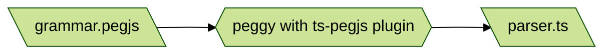

# Hyperscript Transpiled

Live [https://hyperscript-transpiled.netlify.app/]

Experiment to transpile [`_hyperscript`](https://hyperscript.org) into JS.

This repository is running TypeScript, compiling via Vite.JS

This is a continuation of the experiment which started in [this repository](https://github.com/reedspool/hyperscript-transpiled-experiment).

## HTML

The HTML page demos what is currently working.

To see the HTML page in action, you'll need to serve it. An easy way to do this is

```sh
npm run dev # Vite dev server
```

## Generate Parser

To generate the parser file from the grammar file, run `npm run generate_parser`. 

This uses [PeggyJS](https://peggyjs.org/documentation.html) to take the [PEG](https://en.wikipedia.org/wiki/Parsing_expression_grammar) language grammar file and output a parser in a new file. The parser is actually a TypeScript file, thanks to the [ts-pegjs](https://github.com/metadevpro/ts-pegjs) plugin. Neat!

Note the output `parser.ts` file is included in the git repo, so you should only need
to run this if you make changes to `grammar.pegjs`.



## Unit/Integration Tests

NOTE: If you change the parser at all, you'll need to run `npm run generate_parser`
before you run the tests.

When you run `npm test` it runs [Vitest](https://vitest.dev/). Vitest handles conversion from TypeScript to JavaScript internally, the same way Vite does.

All of the `*.test.ts` files will run, and their output will be shown together.

By default, Vitest runs in "watch mode".

## End-to-End Tests

End-to-end tests (`e2e`) in this context mean tests which use a real browser with
the interface to Hyperscript that real users (developers) will use.

The `index.html` page is the surface on which the e2e tests run. Human beings
can open the page and look at it and click the buttons, etc. That is the
exact behavior the e2e tests emulate.

The e2e framework I'm using is [Playwright](https://www.playwright.dev).

The e2e test code lives in `e2e-tests/*.spec.ts`

### Running e2e Tests

All you have to do is `npm run e2e`. 

The `webServer` setting in `playwright.config.ts` causes Playwright to run the 
Vite `build` and `preview` commands instead of the dev server, so that it's
testing exactly what end users see on their browsers.

If you'd like to test against the dev server instead for speed, see the comment
in `playwright.config.ts`.

To run the e2e tests in watch mode, use `npm run e2e:ui` to open the Playwright
test UI, and use the "watch" button there.

## Strategy

My general strategy for adding new features is to start with wishful thinking:

1. Write some code which I wish worked in `index.html`
1. Manually check that it doesn't work yet
1. Write a failing test in `parser.test.js`,
1. Make it pass.
1. Commit
1. Write a failing test in `transpiler.test.js`,
1. Make it pass
1. Amend my commit
1. Write a failing test in `runtime.test.js`,
1. Make it pass
1. Amend my commit
1. Write a failing test in `e2e-tests/*.spec.ts`,
1. Make it pass
1. Amend my commit
1. Manually check that what I wrote in `index.html` works
1. Ensure all the tests still pass
1. Amend my commit
1. Push.

## Decisions

1. Environment must provide a global object, `____`, which has these functions:
   1. `wait(milliseconds)` returns a promise that resolves after the given number of milliseconds 
   1. `next(start, root, selectorString)` finds the next element after `start` matching the selector under the `root` element

`runtime.install(global)` ensures the `____` exists on the given `global`. You probably want to pass `window`.

`runtime.run(source, element)` runs the hyperscript `source` string on the `element`.

Look at tests and `index.html` to determine what works, don't assume. Many things are expected to break all 
the time as this experiment progresses.
